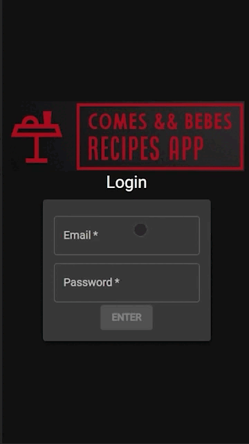

<h1 align="center">👨‍🍳  Recipes App  📱</h1>

<div align="center">
<a href="https://recipes-app-trybe.vercel.app" target="_blank"></a>
</div>

> Click on the gif above to access the deploy

## Description
<p>Recipes App is an application to find, save, and share recipes of all kinds. With the "start a recipe" feature, you can mark the used ingredients as you progress through the preparation. Additionally, you can favorite your preferred recipes and share them with your friends.</p>

## 💻 Tecnologies used
- JavaScript
- React.JS
- Context API
- React-Testing-Library
- BrowserRouter/Router
- Hooks
- MUI Material

## 🛠️ Instructions
#### 📚 Requirements to run this project:
> [![Node.js][Node.js]][Node.js-url]
[![Git][Git]][Git-url]
[![NPM][NPM]][NPM-url]

<br>


```bash
# Clone the repo
git clone https://github.com/caiobacode/Recipes-App-Trybe.git

# Enter in repo
cd Recipes-App-Trybe

# Install dependencies
npm i

# Run App
npm start
```

[Node.js]: https://img.shields.io/badge/-Node.js-80BC02?style=for-the-badge&logo=node.js&logoColor=black
[Node.js-url]: https://nodejs.org/en
[Git]: https://img.shields.io/badge/Git-F05033?style=for-the-badge&logo=git&logoColor=white
[Git-url]: https://git-scm.com
[NPM]: https://img.shields.io/badge/NPM-CC3534?style=for-the-badge&logo=npm&logoColor=white
[NPM-url]: https://www.npmjs.com

# 🔎 Additional details

## Notes
>This project was done in a group

<br>
 <details>
    <summary><strong>👥 Team members</strong></summary>

- [Sérgio Ruza](https://github.com/sergioruza);
- [Lilian Alves Durães](https://github.com/LilianAlvesDuraes);
- [Fernando Barreto Costa](https://github.com/fernando-costa);
- [Arthur Debiasi](https://github.com/arthur-debiasi);
  
  </details>

  <details>
    <summary><strong>🔗 Used APIs</strong></summary>
+ [TheMealDB-API](https://www.themealdb.com/) -  API usada.
+ [TheCocktailDB-API](https://www.thecocktaildb.com/) -  API usada.
  </details>